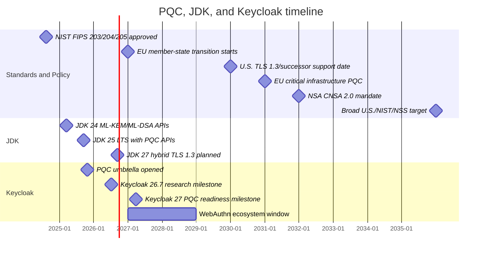

# Post-Quantum Cryptography and Keycloak

Date: 2026-06-22

## Executive summary

- PQC migration is no longer theoretical. NIST finalized the first PQC FIPS standards on 2024-08-13: FIPS 203 (ML-KEM), FIPS 204 (ML-DSA), and FIPS 205 (SLH-DSA).
- NIST has not finished all planned PQC standards: Falcon/FN-DSA and HQC are still listed by NIST as "FIPS coming soon" as of the 2026-06-22 check.
- The strongest hard dates found:
    - EU: Member States should start transition by end of 2026; critical infrastructure should transition no later than end of 2030.
    - U.S. federal non-NSS: inventory started 2023-05-04 and repeats annually until 2035; goal is to mitigate as much quantum risk as feasible by 2035.
    - U.S. agencies: TLS 1.3 or successor support required no later than 2030-01-02.
    - U.S. NSS / DoD / NSA: new NSS acquisitions CNSA 2.0-compliant from 2027-01-01; most unsupported equipment phased out by 2030-12-31; CNSA 2.0 mandated by 2031-12-31 unless noted; complete quantum-resistant NSS target is 2035.
    - Keycloak: PQC readiness is targeted by Keycloak issue milestone 27.0.0, currently due 2027-03-31. Research/spike work is targeted at 26.7.0, currently due 2026-07-08.
- Keycloak's PQC implementation must be assessed against its supported Java baseline. JDK 24 provides ML-KEM/ML-DSA APIs and JDK 27 targets hybrid TLS, but Keycloak may not rely on non-LTS or unsupported Java baselines for production features.
- For TLS, JDK 27 likely covers pure JSSE paths, but Keycloak still needs Quarkus/Netty/OpenSSL, JDBC, LDAP, Infinispan, SMTP, and FIPS-provider validation paths.
- For U.S. federal/DoD users, Keycloak needs TLS 1.3 plus PQC/hybrid TLS before 2030-01-02, CNSA 2.0-compatible options for NSS/DoD timelines, and strong deprecation/removal guidance for vulnerable public-key algorithms before 2035.
- Keycloak has PQC-related PRs: two open ML-DSA PRs, one closed earlier ML-DSA PR, and one merged AKP/JWK parsing PR. There is still no merged end-to-end PQC feature.
- JDK delivery split:
    - JDK 24 (feature release, non-LTS), GA 2025-03-18, delivered ML-KEM and ML-DSA APIs.
    - JDK 25 (LTS), GA 2025-09-16, is the LTS vehicle Keycloak can support, and includes the JDK 24 PQC APIs.
    - JDK 27 (feature release, non-LTS), planned feature release 2026-09-15, targets hybrid ML-KEM TLS 1.3 in JSSE via JEP 527.
    - JDK 29 (next planned LTS), planned for September 2027, is the first planned LTS expected to include both JDK 24 ML-KEM/ML-DSA APIs and JDK 27 hybrid TLS work.
- FIPS 140-4: no official NIST/CMVP plan found. The current active module validation program is FIPS 140-3. PQC is being incorporated through FIPS 203/204/205, CAVP algorithm validation, and FIPS 140-3 implementation guidance, not a visible FIPS 140-4 roadmap.

## Glossary

- PQC: post-quantum cryptography; cryptography intended to resist attacks from cryptographically relevant quantum computers.
- CRQC: cryptographically relevant quantum computer; a quantum computer capable of breaking currently deployed public-key cryptography at useful scale.
- ML-KEM: Module-Lattice-Based Key-Encapsulation Mechanism; NIST FIPS 203 key-establishment algorithm, derived from Kyber.
- ML-DSA: Module-Lattice-Based Digital Signature Algorithm; NIST FIPS 204 signature algorithm, derived from Dilithium.
- SLH-DSA: Stateless Hash-Based Digital Signature Algorithm; NIST FIPS 205 signature algorithm, derived from SPHINCS+.
- FN-DSA: Falcon-derived digital signature algorithm planned by NIST, but not finalized as a FIPS standard as of this report.
- HQC: Hamming Quasi-Cyclic key-encapsulation algorithm selected by NIST for future standardization, but not finalized as a FIPS standard as of this report.
- KEM: key encapsulation mechanism; public-key primitive used to establish shared secrets.
- Hybrid TLS: TLS key exchange combining classical and PQC algorithms so security does not rely only on one new primitive.
- CNSA 2.0: NSA Commercial National Security Algorithm Suite 2.0 for National Security Systems.
- NSS: U.S. National Security Systems.
- JSSE: Java Secure Socket Extension, the standard Java TLS/SSL stack.
- JEP: JDK Enhancement Proposal, the OpenJDK mechanism used to define major JDK features.

## Timeline diagram

## Key dates

| Date | Driver | What changes | Keycloak impact |
| --- | --- | --- | --- |
| 2024-08-13 | NIST | FIPS 203 ML-KEM, FIPS 204 ML-DSA, FIPS 205 SLH-DSA approved. | Keycloak can standardize names and security levels around finalized PQC algorithms. |
| 2025-03-18 | JDK 24 | ML-KEM and ML-DSA APIs delivered; no TLS support. | Useful for conditional provider work only; Keycloak cannot require JDK 24+ yet. |
| 2025-09-16 | JDK 25 LTS | JDK 25 includes the JDK 24 PQC APIs. | Keycloak supports running on OpenJDK 25, but FIPS/container paths still lag. |
| 2026-07-08 | Keycloak 26.7.0 | PQC research, modes, TLS investigation, Java 25/FIPS work targeted. | Expected output is planning and refined tasks, not full PQC production support. |
| 2026-09-15 | JDK 27 planned | JEP 527 hybrid ML-KEM TLS 1.3 in JSSE planned. | Standard Java TLS can cover JSSE paths on JDK 27; Quarkus/Netty/OpenSSL/FIPS remain separate. |
| 2026-12-31 | EU | Member States should start PQC transition by end of 2026. | Keycloak issue #48830 tracks PQC readiness documentation planning before operators need concrete transition plans. |
| 2027-03-31 | Keycloak 27.0.0 | PQC readiness umbrella milestone due. | Target for optional PQC modes and supported protocol pieces where standards/providers allow. |
| 2030-01-02 | U.S. federal TLS | Agencies must support TLS 1.3 or successor. | Keycloak deployments serving U.S. agencies need TLS 1.3 and a PQC/hybrid TLS migration path. |
| 2030-12-31 | EU / DoD | EU critical infrastructure PQC deadline; DoD/NSA phase-out dates for non-CNSA 2.0 equipment/services. | Regulated Keycloak deployments will need production-supported PQC/hybrid TLS and documented crypto posture before this date. |
| 2035 | U.S. / NIST / NSS | U.S. federal quantum-risk target; NIST draft disallows vulnerable public-key crypto after 2035; NSS quantum-resistant target. | Legacy RSA/ECDH/ECDSA-only configurations become incompatible with these regulated timelines unless explicitly out of scope. |

## Government timelines

### European Union

- 2024-04-11: European Commission issued Recommendation (EU) 2024/1101 for a coordinated PQC roadmap.
- 2025-06-23: EU Member States, supported by the Commission, issued the first coordinated roadmap deliverable.
- Required planning direction:
  - Start transition by 2026-12-31.
  - Critical infrastructure transitioned to PQC as soon as possible, no later than 2030-12-31.
- Impact for systems: EU-facing public administration and critical infrastructure deployments should treat PQC support as a 2026 planning requirement and a 2030 critical-infrastructure implementation requirement.

Sources:
- https://digital-strategy.ec.europa.eu/en/library/recommendation-coordinated-implementation-roadmap-transition-post-quantum-cryptography
- https://digital-strategy.ec.europa.eu/en/library/coordinated-implementation-roadmap-transition-post-quantum-cryptography
- https://digital-strategy.ec.europa.eu/en/news/eu-reinforces-its-cybersecurity-post-quantum-cryptography

### Poland

- Poland is aligned with the EU process.
- 2026-06-09: the Council of Ministers adopted Poland's state digitization strategy. It includes preparing a migration plan to post-quantum cryptography and building national cryptographic/quantum competences.
- The Ministry of Digital Affairs' implementation page lists a "National Plan for migration to post-quantum cryptography" as an implementation item.
- No separate Polish hard implementation deadline was found beyond EU deadlines.
- Practical date: use EU dates until Poland publishes its national plan: transition planning by 2026-12-31 and critical infrastructure by 2030-12-31.

Sources:
- https://monitorpolski.gov.pl/MP/2026/620/M2026000062001.pdf
- https://www.gov.pl/web/cyfryzacja/nowa-strategia-cyberbezpieczenstwa-polska-wzmacnia-ochrone-przed-cyberatakami
- https://www.gov.pl/web/cyfryzacja/realizacja-strategii-cyfryzacji-panstwa

### United States - civilian federal systems

- 2022-11-18: OMB M-23-02 directed agencies to prepare for PQC and inventory CRQC-vulnerable cryptography.
- 2023-05-04: first prioritized inventories due; annual submissions continue until 2035 unless superseded.
- 2035: NSM-10 / OMB goal is to mitigate as much quantum risk as feasible by 2035.
- 2030-01-02: agencies must support TLS 1.3 or successor no later than this date.
- Draft NIST IR 8547 transition proposal, not final as of this check:
  - Quantum-vulnerable public-key algorithms at 112-bit security strength deprecated after 2030 and disallowed after 2035.
  - Quantum-vulnerable public-key algorithms at 128-bit or higher security strength disallowed after 2035.
  - Symmetric algorithms with at least 128-bit classical security remain approved.

Sources:
- https://www.whitehouse.gov/wp-content/uploads/2022/11/M-23-02-M-Memo-on-Migrating-to-Post-Quantum-Cryptography.pdf
- https://www.whitehouse.gov/presidential-actions/2025/06/sustaining-select-efforts-to-strengthen-the-nations-cybersecurity-and-amending-executive-order-13694-and-executive-order-14144/
- https://csrc.nist.gov/pubs/ir/8547/ipd
- https://csrc.nist.gov/news/2024/postquantum-cryptography-fips-approved
- https://csrc.nist.gov/projects/post-quantum-cryptography/post-quantum-cryptography-standardization/selected-algorithms
- https://csrc.nist.gov/projects/post-quantum-cryptography/workshops-and-timeline

### U.S. DoD / NSS / NSA

- NSA CNSA 2.0 is the relevant algorithm suite for National Security Systems.
- Key dates:
  - 2025: software and firmware signing should support/prefer CNSA 2.0.
  - 2027-01-01: all new NSS acquisitions expected to be CNSA 2.0-compliant unless otherwise noted.
  - 2030-12-31: equipment and services that cannot support CNSA 2.0 must be phased out unless otherwise noted; software/firmware signing and traditional networking equipment are expected to use CNSA 2.0 exclusively.
  - 2031-12-31: CNSA 2.0 algorithms mandated unless otherwise noted.
  - 2033: web/cloud, operating systems, niche equipment, custom applications and legacy equipment transition targets.
  - 2035: all NSS quantum-resistant target.
- The CIO memo hosted by DoD CIO and labeled "Department of War" requires components to inventory cryptography, identify PQC migration leads, and obtain approval before testing, piloting, acquiring, or deploying PQC-related technology.
- That CIO memo explicitly rejects QKD and most commercial pre-shared-key/symmetric keying approaches as a PQC replacement path, except with defined exceptions.

Sources:
- https://media.defense.gov/2022/Sep/07/2003071836/-1/-1/1/CSI_CNSA_2.0_FAQ_.PDF
- https://media.defense.gov/2025/May/30/2003728741/-1/-1/0/CSA_CNSA_2.0_ALGORITHMS.PDF
- https://dodcio.defense.gov/Portals/0/Documents/Library/PreparingForMigrationPQC.pdf

## FIPS mode and FIPS 140

- Current module validation is FIPS 140-3. CMVP accepts FIPS 140-3 validations; FIPS 140-2 active modules move to Historical after 2026-09-21 for new systems.
- No official FIPS 140-4 plan or date was found.
- PQC can enter FIPS-validated modules through current FIPS 140-3 processes:
  - CAVP supports ML-KEM, ML-DSA, and SLH-DSA validation entries.
  - FIPS 140-3 Implementation Guidance includes ML-KEM and ML-DSA self-test requirements.
- Conclusion: for Keycloak FIPS mode, the near-term dependency is FIPS 140-3-validated crypto providers/modules with FIPS 203/204/205 algorithm validation, not FIPS 140-4.

Sources:
- https://csrc.nist.gov/projects/cryptographic-module-validation-program
- https://csrc.nist.gov/projects/cryptographic-algorithm-validation-program
- https://pages.nist.gov/ACVP/
- https://csrc.nist.gov/csrc/media/Projects/cryptographic-module-validation-program/documents/fips%20140-3/FIPS%20140-3%20IG.pdf

## JDK / OpenJDK PQC status

- JDK 21, GA 2023-09-19, delivered the KEM API (JEP 452). This is an API building block; it did not deliver ML-KEM itself.
- JDK 24, GA 2025-03-18, delivered:
  - ML-KEM via JEP 496: `KeyPairGenerator`, `KEM`, and `KeyFactory` support for ML-KEM-512, ML-KEM-768, and ML-KEM-1024.
  - ML-DSA via JEP 497: `KeyPairGenerator`, `Signature`, and `KeyFactory` support for ML-DSA-44, ML-DSA-65, and ML-DSA-87.
- JDK 24 did not add ML-KEM/ML-DSA to TLS. Both JEP 496 and JEP 497 explicitly left TLS support out until protocol standards existed.
- JDK 25, GA 2025-09-16, is the next LTS release and includes the JDK 24 PQC APIs.
- JDK 25 also delivered a preview PEM API (JEP 470), useful for cryptographic object import/export, but not a PQC protocol feature.
- JDK 26, GA 2026-03-17, delivered the second preview of the PEM API (JEP 524). No new core PQC algorithm or TLS feature was delivered in JDK 26.
- JDK 27:
  - Current status: early access / not GA as of 2026-06-22.
  - Planned feature release date: 2026-09-15.
  - JEP 527 targets JDK 27 and is marked completed for post-quantum hybrid TLS 1.3 key exchange.
  - JEP 527 adds JSSE named groups `X25519MLKEM768`, `SecP256r1MLKEM768`, and `SecP384r1MLKEM1024`.
  - By default, JDK TLS 1.3 will prefer `X25519MLKEM768` when available.
  - Pure non-hybrid ML-KEM TLS is explicitly out of scope for JEP 527.
  - JEP 527 notes the IETF TLS hybrid KEX drafts are still drafts; the JDK may adjust if final RFCs materially change.

Sources:
- https://openjdk.org/jeps/452
- https://openjdk.org/jeps/496
- https://openjdk.org/jeps/497
- https://openjdk.org/jeps/470
- https://openjdk.org/jeps/524
- https://openjdk.org/jeps/527
- https://openjdk.org/projects/jdk/24/
- https://openjdk.org/projects/jdk/25/
- https://openjdk.org/projects/jdk/27/
- https://ops.java/releases/

## Keycloak PQC status

### Current project position

- Keycloak has an active umbrella feature: "Post-Quantum Cryptography (PQC) readiness" (#43690).
- Opened: 2025-10-24.
- Milestone: 27.0.0.
- Current due date from GitHub milestones: 2027-03-31.
- Stated scope:
  - full PQC readiness;
  - crypto review and recommendations;
  - documentation;
  - PQC-safe algorithms where applicable.
- Explicit non-goal for first phase: do not make PQC default and do not remove legacy algorithms yet.

Source:
- https://github.com/keycloak/keycloak/issues/43690
- https://github.com/keycloak/keycloak/milestones?direction=asc&sort=due_date&state=open

### Keycloak planning dates

- 26.7.0 milestone due: 2026-07-08.
- 27.0.0 milestone due: 2027-03-31.
- "Future" milestone due: 2030-12-31.
- Keycloak now supports running with OpenJDK 25, but its container image continues to use OpenJDK 21 for FIPS mode.
- Keycloak issue #43265 tracks OpenJDK 25 support. It is milestone 26.7.0, open, 9/11 subtasks complete, and explicitly says leveraging OpenJDK 25 APIs is a non-goal while Keycloak remains compatible with older releases.
- Keycloak issue #45906 tracks Java 25 with FIPS enabled. CI and code changes are done, but the FIPS guide is not updated for OpenJDK 25 because BCFIPS is not validated with OpenJDK 25.
- Keycloak issue #45830 tracks updating container images to OpenJDK 25. It remains open and blocked by Quarkus 3.31 / related upgrade work.

Sources:
- https://github.com/keycloak/keycloak/milestones?direction=asc&sort=completeness&state=open
- https://github.com/keycloak/keycloak/releases
- https://github.com/keycloak/keycloak/issues/43265
- https://github.com/keycloak/keycloak/issues/45906
- https://github.com/keycloak/keycloak/issues/45830

### Research and readiness work

- "Review what is needed for PQC readiness in Keycloak" (#45168)
  - Opened: 2026-01-06.
  - Milestone: 26.7.0.
  - Purpose: research what Keycloak should plan around, identify ready/upcoming specs, and break work down by team.
  - Project text says later stages will define PQC defaults and legacy deprecation.
- "Create inventory of cryptography in Keycloak" (#48819)
  - Opened: 2026-05-08.
  - Milestone: 26.7.0.
  - Purpose: complete inventory of crypto usage and supported algorithms from a PQC perspective.
- "Cryptographic Inventory for Keycloak" (#46336)
  - Opened: 2026-02-13.
  - Purpose: inventory primitives, algorithms, key sizes, providers, hardcoded uses, and configurable settings.
- "FIPS 203/204/205" (#32528)
  - Opened: 2024-08-30.
  - Older open request for Keycloak support around the finalized NIST PQC standards.
- "Review if there are any areas not identified around PQC readiness" (#48829)
  - Opened: 2026-05-08.
  - Milestone: 26.7.0.
  - Purpose: confirm no affected Keycloak area was missed.
- "Create a plan for documentation around PQC readiness" (#48830)
  - Opened: 2026-05-08.
  - Milestone: 26.7.0.
  - Purpose: define operator documentation for PQC rollout and evaluation.

Sources:
- https://github.com/keycloak/keycloak/issues/45168
- https://github.com/keycloak/keycloak/issues/48819
- https://github.com/keycloak/keycloak/issues/46336
- https://github.com/keycloak/keycloak/issues/32528
- https://github.com/keycloak/keycloak/issues/48829
- https://github.com/keycloak/keycloak/issues/48830

### JDK references in Keycloak PQC tickets

Search scope: GitHub issue search for `PQC`, `post-quantum`, `ML-DSA`, `ML-KEM`, `SLH-DSA`, `CNSA`, plus filtered searches for `JDK`, `OpenJDK`, `Java`, `JEP`, `JDK-`, and `bugs.openjdk.org`, as of 2026-06-22.

No direct `bugs.openjdk.org` or `JDK-xxxxx` issue reference was found. The visible JDK linkage is through JEPs, JDK release versions, and OpenJDK roadmap references.

| Keycloak ticket | JDK / OpenJDK reference found | Interpretation |
| --- | --- | --- |
| #43690 PQC readiness | Search result/comment references Oracle JRA/JDK crypto roadmap and JEP 527. | Umbrella tracks JDK TLS roadmap as a strategic dependency. |
| #45168 PQC readiness review | Search result/comment references ML-KEM/ML-DSA support in JDK 24 and Bouncy Castle 1.79. | Research acknowledges JDK 24 APIs as available building blocks. |
| #48820 TLS PQC investigation | Search result/comment references JEP 527 and OpenJDK 27. | TLS path depends on JDK 27 for JSSE, or on OpenSSL/Netty paths before/alongside that. |
| #49968 Switch internal HTTP client | Issue text says Vert.x/Netty/OpenSSL would allow PQC adoption without relying on OpenJDK PQC support. | Explicitly proposes avoiding JDK dependency for outbound HTTP TLS where OpenSSL is available. |
| #48825 SAML 2.0 PQC investigation | Search result/comment references ML-KEM/ML-DSA support in JDK 24 and Bouncy Castle 1.79. | SAML investigation notes JDK 24 crypto APIs but no direct JDK delivery dependency is defined. |
| #50084 WebAuthn/passkeys | Notes mention Bouncy Castle as an alternative to JDK 24+ / JEP 497 for ML-DSA. | WebAuthn is blocked mainly by webauthn4j/FIDO/browser/authenticator support, with JDK 24+ as one possible ML-DSA provider. |
| #50085 Upgrade webauthn4j | Issue explicitly says current webauthn4j ML-DSA work requires JDK 24+ / JEP 497. | Direct dependency risk unless webauthn4j supports Bouncy Castle or another provider path. |
| #32008, #32528, #43684, #43691, #43692, #43693, #44141, #44142, #46336, #48819, #48821, #48824, #48826, #48827, #48828, #48829, #48830, #49851, #49858, #49860, #49865, #50086 | No explicit JDK/JEP/OpenJDK ticket reference found in issue body or search result snippets. | These may still depend on crypto providers at implementation time, but the ticket text does not pin them to JDK work. |

Sources:
- https://github.com/keycloak/keycloak/issues?q=is%3Aissue+PQC+OR+post-quantum+OR+ML-DSA+OR+ML-KEM+OR+SLH-DSA+OR+CNSA
- https://github.com/keycloak/keycloak/issues?q=is%3Aissue+PQC+OR+post-quantum+OR+ML-DSA+OR+ML-KEM+OR+SLH-DSA+OR+CNSA&page=2
- https://github.com/keycloak/keycloak/issues?q=is%3Aissue+PQC+JDK
- https://github.com/keycloak/keycloak/issues?q=is%3Aissue+PQC+JEP
- https://github.com/keycloak/keycloak/issues?q=is%3Aissue+PQC+OpenJDK
- https://github.com/keycloak/keycloak/issues/43690
- https://github.com/keycloak/keycloak/issues/45168
- https://github.com/keycloak/keycloak/issues/48820
- https://github.com/keycloak/keycloak/issues/49968
- https://github.com/keycloak/keycloak/issues/48825
- https://github.com/keycloak/keycloak/issues/50084
- https://github.com/keycloak/keycloak/issues/50085

### Protocol areas

- OAuth 2.0 / OpenID Connect:
  - Investigation issue #48824 opened 2026-05-08, milestone 26.7.0.
  - Milestone issue #48821 targets PQC-safe algorithms for all OAuth 2.0 and OIDC endpoints/assertions in 27.0.0.
  - #43684, opened 2025-10-23, proposes ML-DSA SignatureProviderFactory and ClientSignatureVerifierProviderFactory; it explicitly says the feature should remain experimental until the final RFC is published.
  - #43692, opened 2025-10-24, targets ML-DSA token signing and verification for OAuth/OIDC.
  - #43693, opened 2025-10-24, targets FN-DSA token signing and verification for OAuth/OIDC. NIST still lists Falcon/FN-DSA as "FIPS coming soon", so this remains ahead of final FIPS standardization.
- SAML 2.0:
  - Investigation issue #48825 opened 2026-05-08, milestone 26.7.0.
  - Scope includes Keycloak as server and client/broker, plus client libraries.
- WebAuthn/passkeys:
  - Investigation issue #48826 opened 2026-05-08 and is closed; it produced the refined WebAuthn issues.
  - Milestone issue #50084 opened 2026-06-17, milestone 27.0.0.
  - Goal: ML-DSA COSE algorithm IDs in WebAuthn policy, registration, and admin UI.
  - #50085 opened 2026-06-17 to upgrade webauthn4j to a version with ML-DSA support; it explicitly notes current upstream work requires JDK 24+ / JEP 497 unless Bouncy Castle or another provider path is used.
  - #50086 opened 2026-06-17 to add ML-DSA COSE algorithm IDs to WebAuthn policies.
  - Blocked on FIDO test vectors, webauthn4j ML-DSA support, and production browser/authenticator support.
  - Keycloak issue estimates realistic WebAuthn PQC ecosystem timeline as 2027-2028.

Sources:
- https://github.com/keycloak/keycloak/issues/48821
- https://github.com/keycloak/keycloak/issues/48824
- https://github.com/keycloak/keycloak/issues/43684
- https://github.com/keycloak/keycloak/issues/43692
- https://github.com/keycloak/keycloak/issues/43693
- https://github.com/keycloak/keycloak/issues/48825
- https://github.com/keycloak/keycloak/issues/48826
- https://github.com/keycloak/keycloak/issues/50084
- https://github.com/keycloak/keycloak/issues/50085
- https://github.com/keycloak/keycloak/issues/50086
- https://github.com/keycloak/keycloak/discussions/40496

### TLS and outbound HTTP

- "Hybrid key exchange in TLS 1.3" (#43691)
  - Opened: 2025-10-24.
  - Goals: documentation, configuration options, performance/general testing.
  - Non-goal: underlying implementation comes from Quarkus.
- TLS investigation (#48820)
  - Opened: 2026-05-08.
  - Milestone: 26.7.0.
  - Scope includes incoming/outgoing HTTP, LDAP, databases, Infinispan, SMTP.
- Internal HTTP client change (#49968)
  - Opened: 2026-06-12.
  - Proposes moving from Apache HTTP Client to Vert.x/Netty to support PQC/hybrid TLS with OpenSSL when available.
  - Notes that hybrid key exchange will require OpenSSL presence and needs optional/configurable handling.
- JDK impact:
  - Before JDK 27, Java's standard JSSE TLS stack does not provide hybrid ML-KEM TLS.
  - From JDK 27 onward, Keycloak deployments running on JDK 27 should get JSSE hybrid TLS 1.3 support for code paths that use `javax.net.ssl` and do not override named groups.
  - Keycloak still needs separate handling for Quarkus/Vert.x/Netty/OpenSSL paths, database drivers, LDAP, Infinispan, SMTP, and FIPS-approved providers.

Sources:
- https://github.com/keycloak/keycloak/issues/43691
- https://github.com/keycloak/keycloak/issues/48820
- https://github.com/keycloak/keycloak/issues/49968
- https://openjdk.org/jeps/527

### Defaults and modes

- PQC modes (#49851), opened 2026-06-10, milestone 26.7.0:
  - Enabled: PQC alongside legacy.
  - Transitional: PQC default, legacy allowed with warnings.
  - Enforced: only PQC-safe crypto.
- Cookies:
  - Investigation issue #48827 opened 2026-05-08, milestone 26.7.0.
  - Cookie milestone #49865 opened 2026-06-10, milestone 27.0.0.
  - #49858 proposes increasing AES default from 128 to 256 for KC_RESTART cookie / realm AES defaults.
  - #49860 proposes SHA384 or SHA512 for AUTH_SESSION_ID_HASH and SESSION cookies instead of SHA256.
  - Both are milestone 27.0.0.

Sources:
- https://github.com/keycloak/keycloak/issues/49851
- https://github.com/keycloak/keycloak/issues/48827
- https://github.com/keycloak/keycloak/issues/49865
- https://github.com/keycloak/keycloak/issues/49858
- https://github.com/keycloak/keycloak/issues/49860

### Older / rejected discussion

- Password hashing discussion #32007 and issue #32008 were opened 2024-08-08.
- #32008 is closed as "not planned".
- Newer issue #48828 reopened the topic as investigation only: decide whether existing Keycloak password hashing is PQC-safe and create follow-up tasks if needed.

Sources:
- https://github.com/keycloak/keycloak/discussions/32007
- https://github.com/keycloak/keycloak/issues/32008
- https://github.com/keycloak/keycloak/issues/48828

### Pull requests

- GitHub PR search for `is:pr PQC OR post-quantum OR ML-DSA` currently shows 2 open and 9 closed matching PRs.
- Open:
  - #44238 "MLDSA Keys", opened 2025-11-14: adds key providers and algorithm identifiers for ML-DSA; requested changes; no milestone.
  - #44597 "MLDSA Signatures", opened 2025-12-02: adds ML-DSA signature support; builds on #44238; no milestone.
- Merged:
  - #44203 "Add support for AKP JWK parsing building", merged 2025-11-17.
- Closed:
  - #43857 "Adding ML-DSA support", opened 2025-10-30 and closed 2026-05-21; discussion notes it needed scope reduction, feature flag/experimental handling, and tests.
- WebAuthn PQC is still blocked by upstream webauthn4j and ecosystem prerequisites; no WebAuthn PQC implementation PR was found.

Sources:
- https://github.com/keycloak/keycloak/pulls?q=is%3Apr+PQC+OR+post-quantum+OR+ML-DSA
- https://github.com/keycloak/keycloak/pull/44238
- https://github.com/keycloak/keycloak/pull/44597
- https://github.com/keycloak/keycloak/pull/44203
- https://github.com/keycloak/keycloak/pull/43857
